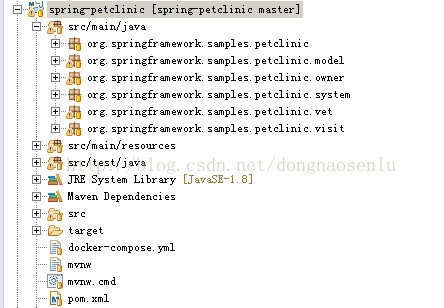

###Spring 中的注解与分层思想
在Spring框架中最常见的几个注解

@Controller, @Service, @Component, @Repository

其中@Component是一种通用名称，泛指任意可以通过Spring来管理的组件，@Controller, @Service, @Repository则是一种特定的组件，通常用来表示某种特定场合下的组件，比如@Repository用来表示仓库（数据层，DAO），并且Spring 框架会根据这种应用场景做些定制，比如@Repository同时具备了自动化的异常转换。类似的， @Service则用来表示服务层相关的类， @Controller则用来表示展示层（presentation）的类。

那Service是什么呢？

 

Service 表示了在软件分层设计中的Service层，用来连结数据层（DAO）和展示层（Presentation）。

 

为什么要在DAO层上加一层Service呢？

在某些简单的应用中，DAO层的功能和Service的功能很接近，甚至初学者会觉得Service层做的事情和DAO层都一样，那为啥还要将Service层单独拿出来做一遍呢？而且，很多场景下，Service层和DAO层同时存在，往往会增加代码复杂度，编码工作量，写的不好甚至会造成混淆。

通常来说，DAO层应尽力保持简单，其功能仅仅是提供了数据库的连接，以及最简单的增删改查（Crud），有时还需要做些抽象，以此来连接使用不同技术的数据库。除此之外，任何业务相关的操作都应该放到Service层，即Service层用来编写业务逻辑，即操作从DAO层读取的数据，或者将处理好的数据给DAO层，当使用Domain Driven Design时， 这两个类通常会放到同一个Domain（包）中，即便在简单的应用中，他们的代码可能极其类似，但是仍应该分别对待。而不是跳过service层（service）直接去使用DAO层（repository）来放业务逻辑数据。

这样带来的好处带来更好的模块化结构，有便于后期的扩展和维护，比如更换数据库实现时，我们仅仅需要处理DAO层的内容就好了。并且，当业务逻辑比较复杂的时候，比如有很多报告要出的时候，Service层就提供了一个很好的空间来实现这些代码。

其次，在web应用开发中，使用Service层可以将web类的活动限制在controller中，这样可以独立的测试service层

另外，还有一种情况，就是当应用极其复杂，需要同时使用多种数据库时，将从DAO中获取数据的动作放到一起可以减少数据库的操作，并且可以保证数据的一致性。同时Service可以嵌套，因此如果需要使用不同的数据库时，可以在service中指定。

在Service中也可以放一些通知类的操作，比如发送邮件等，这样也可以保持controller的整洁。

还有一个潜在的好处是安全性，当使用service层包裹DAO层后，数据库的链接是被service层保护起来的，这样如果客户端被某种情况攻陷，其只能使用service层提供的有限数据，而无法直接攻击数据库

 

另外，在Spring 框架中，security也是在Service层实现的。根据上面的逻辑，我们在实际开发中，应该不去实现自己的DAO层，而是使用Spring Data JPA，因为Spring Data JPA已经实现了DAO层。

 

这种写法常见的问题有啥？

最常见的写法（或者是错误的写法）有以下几种

1、面向领域的模型对象仅仅用来存储应用中的数据，换句话说，是不太符合domain model 设计的

2、处理模型数据的业务逻辑分散在service层

3、每个entity都有对应的service类

 

这样写的原因很大程度来源于上面的分层理论，我们确实将应用分成了展示层（web layer），服务层（service layer），数据层（repository/dao），但是实际后果却是一个极其庞大的service层，这种写法可以算是一个面向过程开发的代码（procedural code）， 而不是面向对象开发。好处是简单，当业务不复杂时，确实没有必要使用一个庞大的面向对象开发框架（domain driven design）。

一个责任并不明确的service层主要有以下问题

1、业务逻辑分散在service层中，当我们需要确认或者检查某个业务逻辑时，可能要在多个service类中寻找，也许并不那么容易，另外如果同样的业务逻辑在多个service类中用到时，那么可能会存在大量的重复代码，这种重复代码对于维护人员来说就是恶魔。

2、在service层中，每个entity都有对应的service类时，service层会有过多的依赖，甚至是循环依赖关系，而不是由松散耦合的service类构成service层，理想中的service层应该是由具有单一责任的service类构成，并且这些service类具有松耦合关系，如果不是这样的service层，将难以理解，维护和重用。

 

主要的解决方法是

1、将与entity相关的业务逻辑统一放到领域模型对象相关的类中，即所谓的domain service中。这样做的好处时，传统概念中的service层仅仅处理应用相关的业务逻辑，即作为Application Service。 然后domain service中处理domain 内的业务逻辑。业务逻辑将按照domain和application的方式分开，容易定位和维护。传统意义上的applicationservice层将变得整洁。

 

2、在domain service中我们将按照entity来编写对应的service，这些都是特定的service，很小，仅仅面对很专一的功能。举例来说，如果应用中的某个service提供person类的crud， 同时还提供用户帐号的操作，那么我们应该将person的crud单独放到一个service中，然后将用户帐号相关的操作放到另一个service中。

所有这些分层方式都是为了解决应用从小项目成长为大项目时可能遇到的隐患，代价是在项目还小时，增加了项目的复杂度，往往一句代码就能搞定的事情，却要拆到三个类中去。但是太多的实际例子表明，如果没有好的架构，当小项目膨胀到一定程度时，往往是无法维护的，只能全部推倒重写。

 

在Domain Driven Design中如何区分各种Service？

在DDD中，service有三种类型

Domain Service

Domain Service: 用于放置领域对象相关的业务逻辑，这些业务逻辑通常并不适合放到entity中，也不是常见到的CRUD(这些应该放到Repository)， 将Domain Service 和Domain Objects放到一起是合理的，它们都是关注于domain相关的业务逻辑。在Domain Service中可以使用注入repository的方式来使用entity对应的repository。

举一个例子：

一个图书馆有三个entity：Book， Client，Inventory， 当把一本书借给一个客户时，就对应了一个Domain Service。在一个例子，在Eric Evans的《Domain Driven Design》书中，转账服务（FundsTransferService）也是一种domain service，它涉及到帐号BankAccount，但是并不适合放到BankAccount中。

Application Service

Application Service: 用于为应用外的client或consumer提供应用级别的服务，比如一个外部客户端（程序）需要使用某个entity的CRUD时，这些服务程序放到Application Service。

Application Service通常会使用Domain Service和repository来处理外部的请求。常见的场景是，从repository中拿到一些domain objects， 然后执行某些操作，在将其放回repository（或者不放）， Application Service对应着大部分用户使用场景，在写一个应用时，可以先从Application service写起，这样可以很好界定应用的功能和范围。repository虽然可以在某些场景下注入到domain service中，但是更常见的是注入到applicatinoservice中。

Infrastructure service

还有一种Infrastructure service：用于抽象一些技术问题，比如消息队列，邮件服务

具体例子spring-petclinic

